# NCA_2nd Round

## Data by age
##### Start with **17 valid samples**
1. 3 weeks: 6 samples
2. 6 weeks: 6 samples --> 2 of them are invalid --> 4 valid samples
3. 9 weeks: 4 samples --> 1 of them is invalid --> 3 valid samples
4. 12 weeks: 4 samples

| No. | Age | Sample line |    Date   |  Tech  |     Index     |   df name  | Space |       Remarks       |
|:---:|:---:|:-----------:|:---------:|:------:|:-------------:|:----------:|:-----:|:-------------------:|
|  1  |  6W |    45F_01   |  8/4/2020 | indrop |  1 - CTCTCTAT |  w6_45f.01 | whole |     **invalid data file**     |
|  2  |  6W |    47F_01   |  8/4/2020 | indrop |  2 - TATCCTCT |  w6_47f.01 | whole |     **invalid data file**     |
|  3  |  6W |     G10     |  8/4/2020 | indrop |  3 - GTAAGGAG |   w6_g10   | whole |                     |
|  4  |  6W |      WT     |  8/4/2020 | indrop |  4 - ACTGCATA |    w6_wt   | whole |                     |
|  5  |  6W |    45F_02   |  8/4/2020 | indrop |  5 - AAGGAGTA |  w6_45f.02 | whole |                     |
|  6  |  6W |    47F_02   |  8/4/2020 | indrop |  6 - CTAAGCCT |  w6_47f.02 | whole |                     |
|  7  |  3W |     45F     | 8/21/2020 | indrop |  7 - CGTCTAAT |   w3_45f   | whole |                     |
|  8  |  3W |     47F     | 8/21/2020 | indrop |  8 - TCTCTCCG |   w3_47f   | whole |                     |
|  9  |  3W |     G10     | 8/21/2020 | indrop |  9 - TCGACTAG |   w3_g10   | whole |                     |
|  10 |  3W |      WT     | 8/21/2020 | indrop | 10 - TTCTAGCT |    w3_wt   | whole |                     |
|  11 |  3W |   45F nuc   | 8/21/2020 | indrop | 11 - CCTAGAGT | w3_45f_nuc |  nuc  |                     |
|  12 |  3W |   47F nuc   | 8/21/2020 | indrop | 12 - GCGTAAGA | w3_47f_nuc |  nuc  |                     |
|  13 | 12w |     45f     | 10/2/2020 | indrop | 13 - CTTAATAG |   w12_45f  | whole |                     |
|  14 | 12w |     47f     | 10/2/2020 | indrop | 14 - ATAGCCTT |   w12_47f  | whole |                     |
|  15 | 12w |     g10     | 10/2/2020 | indrop | 15 - TAAGGCTC |   w12_g10  | whole |                     |
|  16 | 12w |      wt     | 10/2/2020 | indrop | 16 - TCGCATAA |   w12_wt   | whole |                     |
|  17 |  9w |     45f     | 10/8/2020 | indrop | 17 - TTACCTCC |   w9_45f   | whole | **seurat dim 0 x 3** |
|  18 |  9w |     47f     | 10/8/2020 | indrop | 18 - CAGTTATG |   w9_47f   | whole |                     |
|  19 |  9w |     g10     | 10/8/2020 | indrop | 19 - CCTTTACT |   w9_g10   | whole |                     |
|  20 |  9w |      wt     | 10/8/2020 | indrop | 21 - GAGACGGA |    w9_wt   | whole |                     |

## Quality metrics (17 datasets)

**1. Cell counts by sample**

 
**2. Number of UMIs/transcripts per cell**

**3. Detected unique genes per cell**

- The 12-week g10 sample shows a way lower gene counts than other samples

- **Median value of unique gene counts by sample**

|   Sample   | Median Gene Counts |
|:----------:|:------------------:|
|    w3_wt   |        313.0       |
|   w3_g10   |        275.0       |
|   w3_47f   |        337.0       |
|   w3_45f   |        258.0       |
| w3_47f_nuc |        235.0       |
| w3_45f_nuc |        238.0       |
|    w6_wt   |        301.0       |
|   w6_g10   |        326.0       |
|  w6_47f.02 |        388.0       |
|  w6_45f.02 |        402.0       |
|    w9_wt   |        242.5       |
|   w9_g10   |        219.0       |
|   w9_47f   |        128.0       |
| **w9_45f** |       **0.0**      |
|   w12_wt   |        223.0       |
|**w12_g10** |       **11.5**     |
|   w12_47f  |        244.5       |
|   w12_45f  |        264.5       |

**4. UMI-Unique genes-Mitochondrial content**

- The 12-week g10 sample shows low quality characteristics. 
- Positioned under the set intercepts.

**5. Complexity**

- The 12-week g10 sample shows very low complexity when compared with other samples. 

 
**6. Violin plots by sample**

- The 3rd columns are mitrochondrial content %. (sample names were added only for the convenience purpose)
- [Violin Plots](https://github.com/dearzoo/16.-NCA_scRNA_2nd/blob/main/figures/violin/qc_violin_with_names.pdf) for the violin plots

### Filtration (What will be included in downstream analysis?)

#### 1. Sample-level

* **6W 45F_01 and 6W 47F_01** excluded (already excluded)
   - invalid data files 
* **9w 45F** excluded
   - invalid seurat object 

* *additionally* **12w g10** excluded when integrating objects
   - due to its low quality (too low in unique gene numbers)

#### 2. Cell-level filtration

* gene counts 200~4,000
* mito content < 40%

### Cell cycle effect as an unwanted variation
* Using the filtered seurat objects (gene counts between 200-4k with mito content less than 40%), check the crude cell cycle effect.
* The PCA plot by cell cycle doesn't show any huge difference between cell cycle, so cell cycle is unlikely to make unwanted variations.

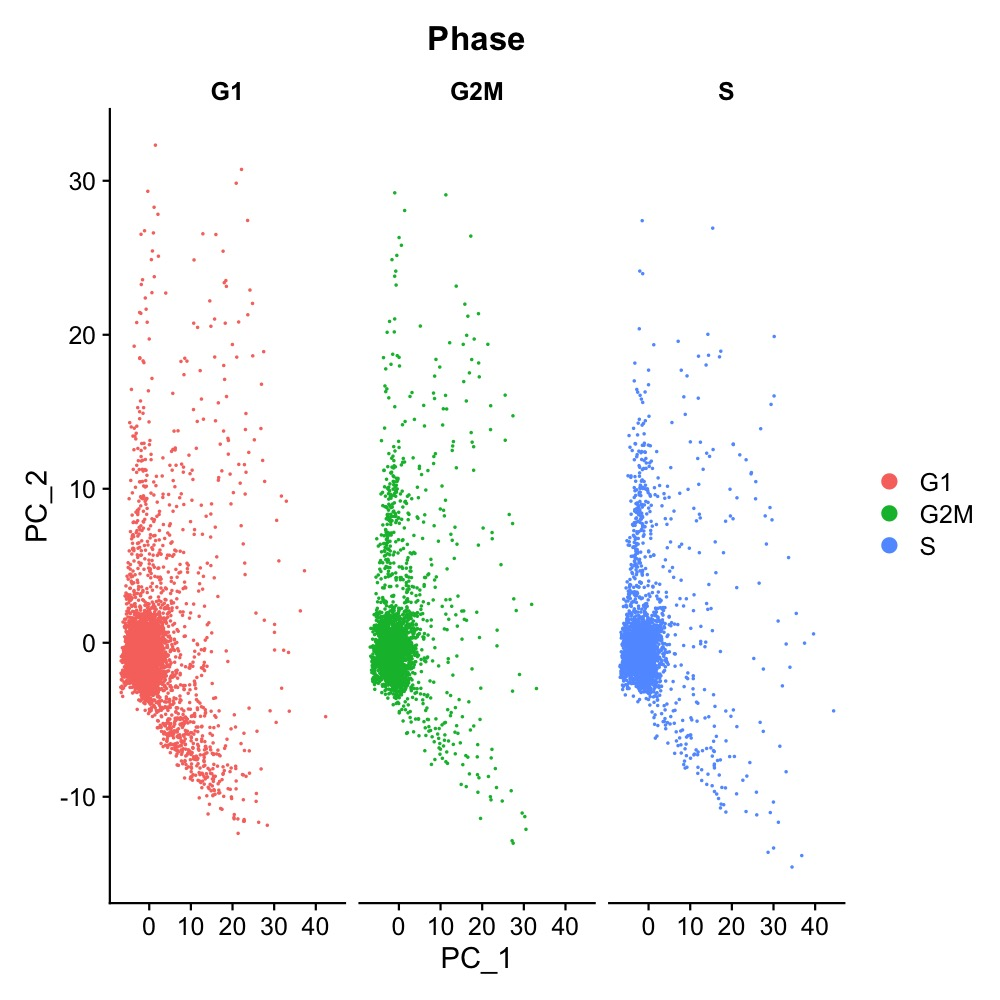

## Integration

1. Error occurred while finding Integration Anchors
 * element 13 has fewer than 30 cells, which is the default value of dim.
 

  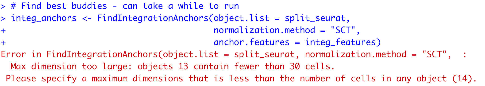
  
  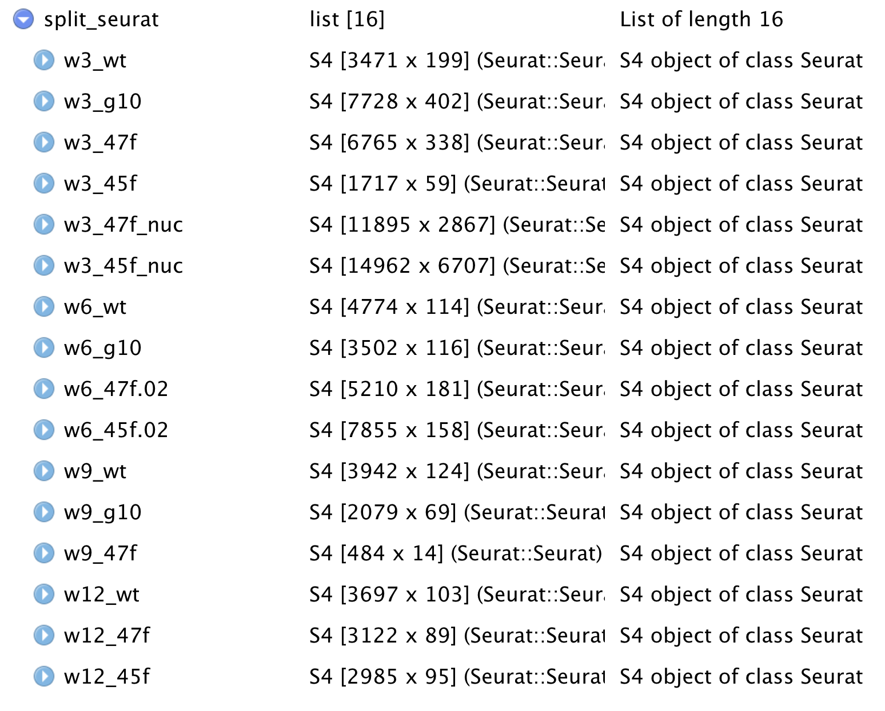
  

2. Needed to exclude w9_47f from the integration or lower the dim value so it can still include w9_47f

3. After adjusting the dim from 1:30 to 1:13, another error while finding integration anchors 

  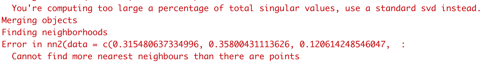

4. So, excluded w9_47f from the integration list.

5. Another issue occurred
   - The lowest number of cells among the sample list is lower than the k.filter default, which is 200. 

  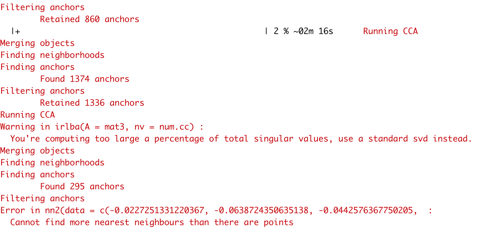
  
  - Therefore, adjust the k.filter from 200 to 59, which is the minimum cell counts among the list.
  

6. Integration across conditions done!

## Reduction
### PCA

  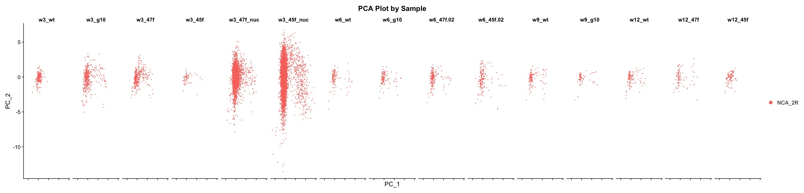

### Clustering results

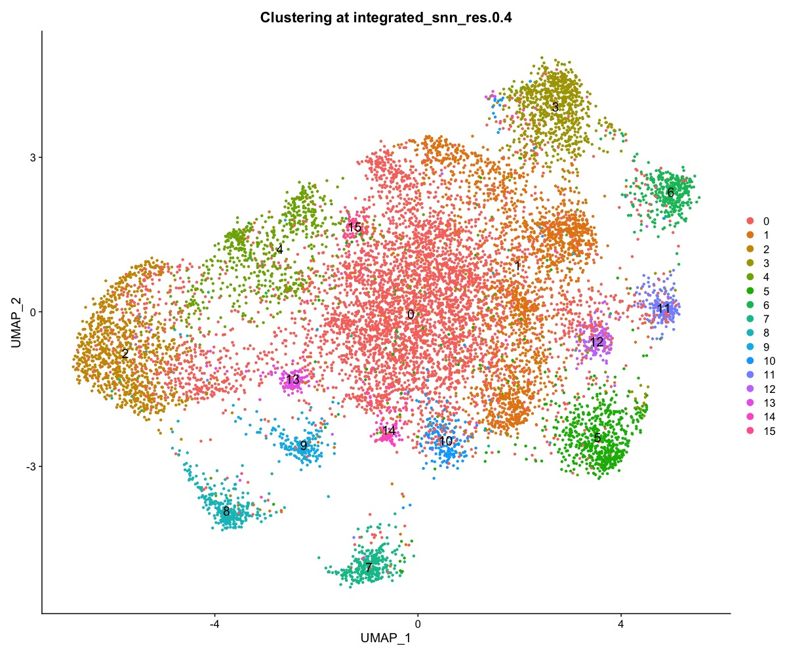
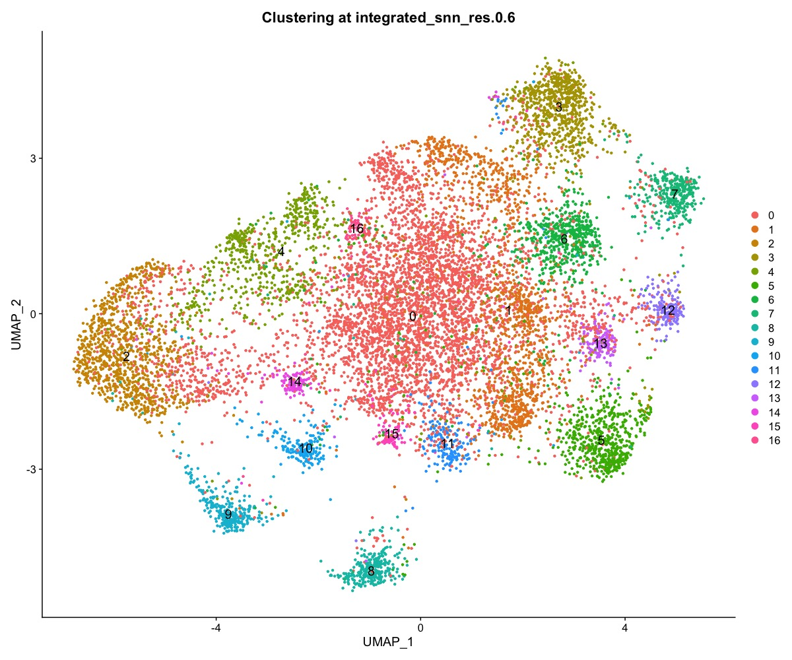
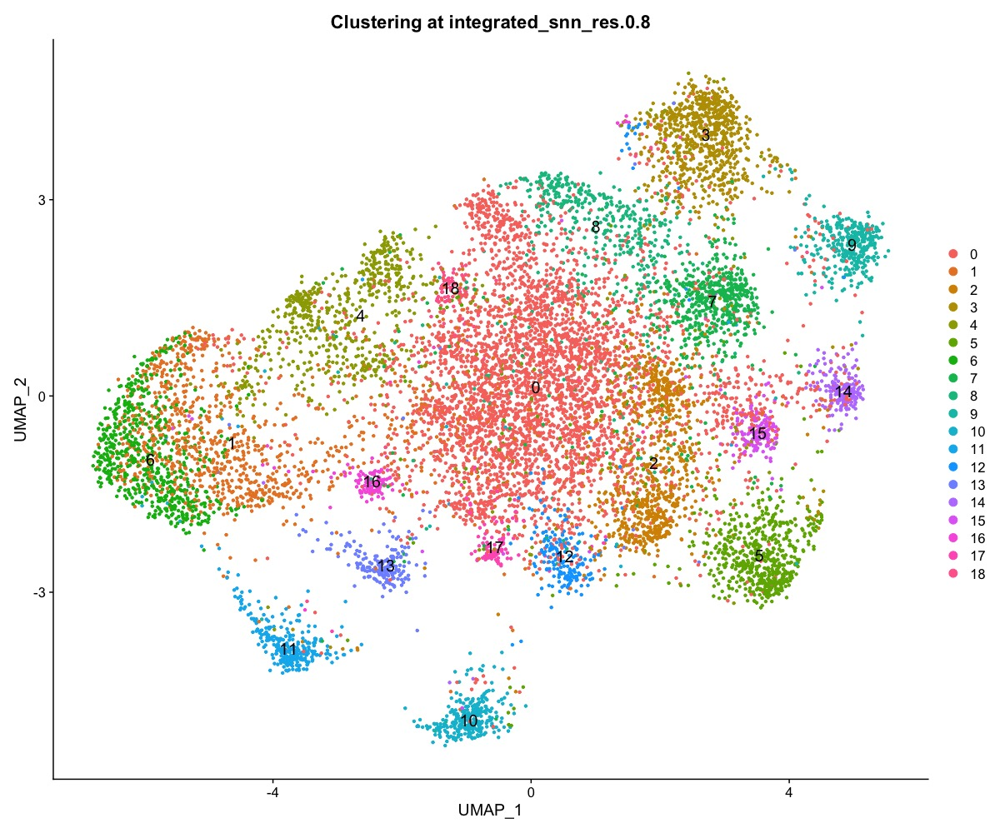
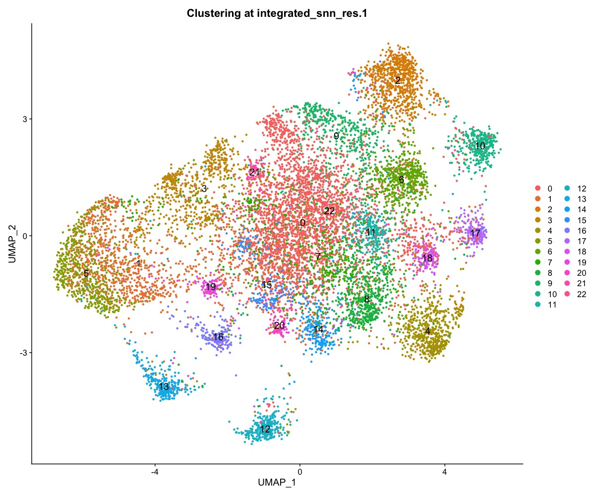
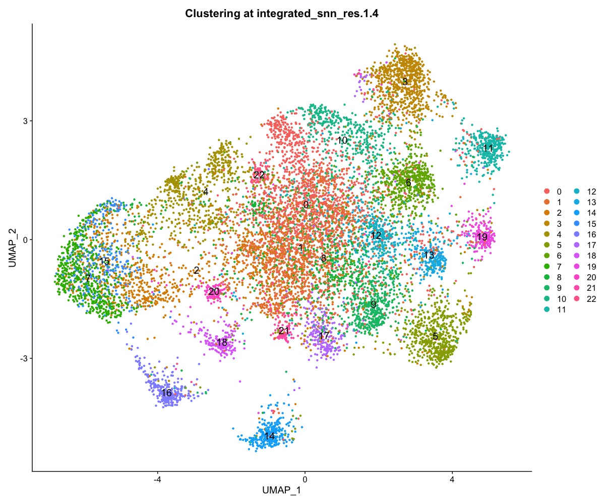

